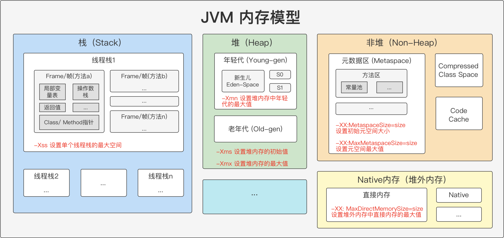

## 作业内容
（必做）画一张图，展示 Xmx、Xms、Xmn、Meta、DirectMemory、Xss 这些内存参数的关系

## 内存关系图 (含常用参数)
### 整理依据
1. 画出 JVM 内存区域布局
2. 将常用的内存参数：Xmx、Xms、Xmn、Meta、DirectMemory、Xss标记出来

### 常用内存参数关系
- 堆内存 (Xms ~ Xmx) = 年轻代 (~Xmn) + 老年代
- 非堆 = Meta + CodeCache + CompressedClassSpace + ...
- Native内存 = 直接内存 + Native + ...
- 栈内存 = n * Xss

 

