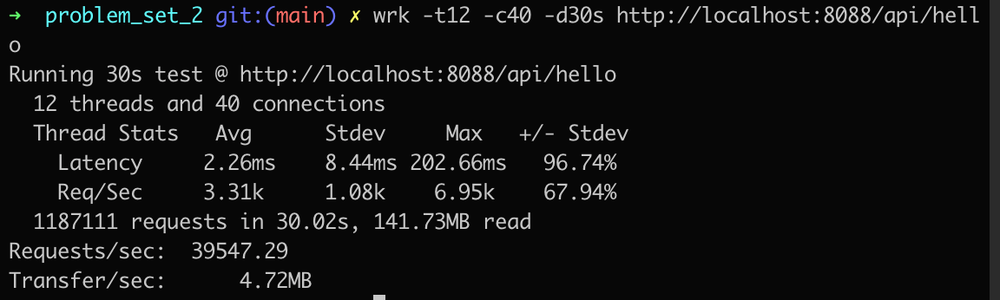

## 作业内容
使用压测工具（wrk 或 sb），演练 gateway-server-0.0.1-SNAPSHOT.jar 示例

## 操作步骤
1. 在终端使用命令下载压测工具 wrk： `brew install wrk`
2. 参考 wrk 工具[官方描述](https://github.com/wg/wrk)
3. 在终端使用命令启动 gateway-server：`java -jar -Xmx512m -Xms512m gateway-server-0.0.1-SNAPSHOT.jar`
4. 访问地址，查看服务是否已启动：http://localhost:8088/api/hello
5. 使用命令压测：`wrk -t12 -c40 -d30s http://localhost:8088/api/hello`
6. 压测结果图如下

