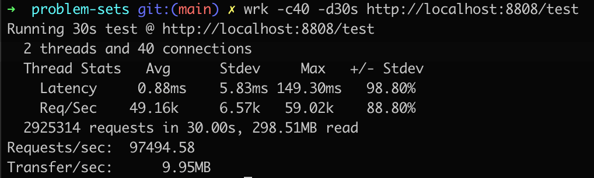

## 作业内容
运行课上的例子，以及 Netty 的例子，分析相关现象

## 操作步骤
1. 编写 HttpServer01.java 程序
2. 编写 HttpServer02.java 程序
3. 编写 HttpServer02.java 程序
4. [Netty的例子](https://github.com/junyangwei/java-problem-sets/tree/main/02nio/problem_set_5/nio01)

- 通过 `javac HttpServer01.java` 命令，再使用 `java HttpServer01` 启动程序
- 就可以通过 http://localhost:8801 访问了，其他两个同理

## 分析
服务器通信原理

### 分析
| 类型         | 分析                                                         | 分析                                                         |
| ------------ | ------------------------------------------------------------ | ------------------------------------------------------------ |
| HttpServer01 | - 服务端构造一个绑定了8801端口的ServerSocket类对象 - 轮询检查是否有客户端发送请求过来(端口监听) - 如果有则模拟输出 HTTP 报文头和返回体 - 关闭资源 | - 单线程处理 socket - 效率比较低                        |
| HttpServer02 | - 服务端构造一个绑定了8802端口的ServerSocket类对象 - 轮询检查是否有客户端发送请求过来(端口监听) - 如果有创建一个新的线程，在这个线程中模拟输出 HTTP 报文头和返回体 - 关闭资源 | - 每个请求新增一个线程 - 非常浪费资源                   |
| HttpServer03 | - 构建一个固定大小的线程池 - 服务端构造一个绑定了8803端口的ServerSocket类对象 - 轮询检查是否有客户端发送请求过来(端口监听) - 如果有则从固定的线程池中分配一个线程，在这个线程中模拟输出 HTTP 报文头和返回体 - 关闭资源 | - 每个请求会分配到固定线程池中的一个线程 - 效率更高并且不会浪费更多的资源 |
| nio01        | - 构建了两个事件驱动类 (EventLoopGroup) 对象，一个用于接收客户端请求，一个处理客户端请求(业务处理) - 构建了一个 ServerBootstrap 类对象，作为启动的入口点 - 为启动入口点绑定了一些 Channel 参数 - 为启动入口点绑定两个事件驱动类对象 - 将启动入口点帮定在8808端口，并开启通道(channel)，将服务启动，开始接收客户端数据 | - 同样采用固定线程池的方式，分别交给接收请求的事件驱动器和处理业务的事件驱动器，保证效率高的同时不会浪费太多资源 - 网络处理和业务逻辑解耦，更便于维护 - 基于NIO，吞吐量大幅度提高  |

