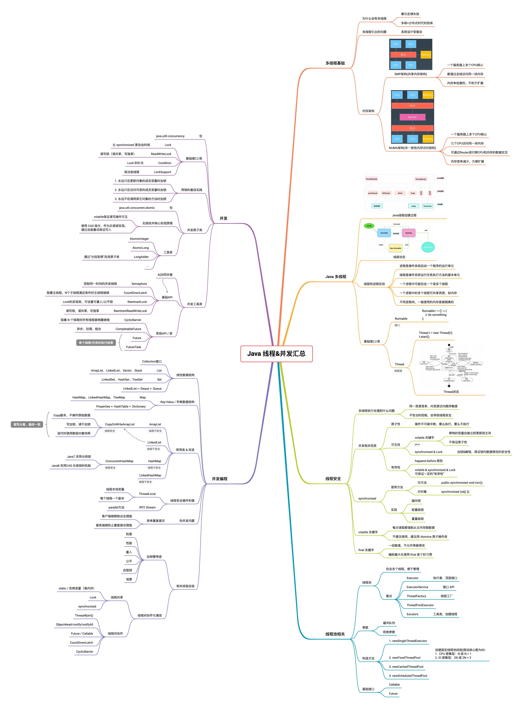

# 第四周作业
1. （选做）把示例代码，运行一遍，思考课上相关的问题。也可以做一些比较。
2. （必做）思考有多少种方式，在 main 函数启动一个新线程，运行一个方法，拿到这
个方法的返回值后，退出主线程? 写出你的方法，越多越好，提交到 GitHub。
3. （选做）列举常用的并发操作 API 和工具类，简单分析其使用场景和优缺点。
4. （选做）请思考: 什么是并发? 什么是高并发? 实现高并发高可用系统需要考虑哪些 因素，对于这些你是怎么理解的?
5. （选做）请思考: 还有哪些跟并发类似 / 有关的场景和问题，有哪些可以借鉴的解决 办法。
6. （必做）把多线程和并发相关知识梳理一遍，画一个脑图，截图上传到 GitHub 上。 可选工具:xmind，百度脑图，wps，MindManage，或其他。

## 作业1
把示例代码，运行一遍，思考课上相关的问题。也可以做一些比较。
- [运行代码示例后的注释](https://github.com/junyangwei/JavaCourseCodes/commit/0887f4f21e65f46bfd3e24c8e97731108240db02)

## 作业2
思考有多少种方式，在 main 函数启动一个新线程，运行一个方法，拿到这
个方法的返回值后，退出主线程
- [编码地址](https://github.com/junyangwei/java-problem-sets/blob/main/04fx/src/main/java/concurrency/NewThreadGetTest.java)

## 作业3
列举常用的并发操作 API 和工具类，简单分析其使用场景和优缺点

| 分类         | API                  | 使用场景                                                     | 优点                                                         | 缺点                               |
| ------------ | -------------------- | ------------------------------------------------------------ | ------------------------------------------------------------ | ---------------------------------- |
| 锁机制类     | Lock                 | - 接口 - 定义基本的加锁和解锁方法                       | - 比synchronized更灵活                                       |                                    |
| 锁机制类     | Condition            | - 结合Lock接口使用                                           | - 能够结合Lock做耕细粒度的控制                               |                                    |
| 锁机制类     | ReentrantLock        | - Lock的实现类 - 构造Lock接口的实现类 - 一般需要使用锁的场景都适用 | - 比synchronized更灵活 - 实现可重复锁，公平锁等等       |                                    |
| 锁机制类     | ReadWriteLock        | - 接口 - 定义了读锁和写锁 - 作为 Lock 的补充 - 适合读多写少的场景 | - 保证写为独占锁 - 读为共享锁                           |                                    |
| 锁机制类     | LockSupport          | - 暂停/恢复当前线程的操作场景                                | - 便于更灵活的控制当前线程的暂停与恢复                       | - 恢复被暂停的线程操作稍微有点麻烦 |
| 原子操作类   | AtomicInteger        | - 对整型数值保证多线程安全的操作                             | - 已封装好的类，便于使用 - 使用无锁技术，执行效率有一定保障 |                                    |
| 原子操作类   | AtomicLong           | - 对Long类型数值保证多线程安全的操作                         | - 同上                                                       |                                    |
| 原子操作类   | LongAdder            | - 对Long类型数值保证多线程安全的操作                         | - 对AtomicLong进一步优化，采用分段设计思路，进一步提高了执行效率 |                                    |
| 信号量工具类 | CountDownLatch       | - 需要暂定主线程，等待N个线程执行完毕后的场景                | - 为多个线程更灵活的控制提供了一定的方式                     |                                    |
| 信号量工具类 | CyclicBarrier        | - 等待N个线程，直到所有指定线程都在等待时再继续的场景        | - 为多个线程更灵活的控制提供了一定的方式                     |                                    |
| 信号量工具类 | Semaphore            | - 控制当前线程并发数的场景                                   | - 能够更好地控制当前线程并发个数                             |                                    |
| 并发集合类   | CopyOnWriteArrayList | - 需要保证ArrayList的读写线程安全的场景                      | - 采用“副本”的设计思路，来保障ArrayList的读和写操作都是线程安全的 |                                    |
| 并发集合类   | ConcurrentMap        | - 需要保证Map实现类读写线程安全的场景                        | - 提供保证 Map 线程安全的实现类，不需要自己再控制            |                                    |

## 作业4
### 什么是并发？
- 以一个实际例子来说明，如：双11有准点抢购活动，同一对鞋子，有非常多人喜欢，在准点的时候，这些人一窝蜂的抢购，这个"抢购"的过程就可以称为并发
- 再以一个Java进程中多个线程为例，在同一时刻，多个线程都需要执行某一段代码，也许是获取某个数据，也许是改某个数据等等，这个过程可以称为多个线程的并发
- 再以多个Java进程为例，在同一时刻，多个进程中各自都有一个线程，需要连接数据库，改某个相同的数据，比如多个用户同时抢购鞋子，都会导致库存减1，这个过程可以称为多个进程的并发

### 什么是高并发？
- 简而言之，当并发的量大到一定程度，就可以称为高并发
- 比如双11活动，可能很多商品都有几万个人同时抢，而往高一点看，这是一个几百万甚至是几千万人在抢购商品的活动

### 实现高并发高可用系统需要考虑哪些因素
1. 首先，需要从实际业务出发，需要清晰地了解哪些业务模块是需要保证"高并发"或是"高可用"
2. 其次，需要了解/定义清楚，高并发/高可用我需要高到什么程度（知道自己的目标上限需要多高）
3. 然后，再到架构选型，使用什么框架、数据库、缓存、消息等等
4. 而后，就是具体的业务实现了
5. 之后，需要对具体的业务服务进行单机压测，看看当前支持的平均并发数在哪儿（多压几次，取平均值）
6. 再根据这些具体的数据，计算需要的机器以及机器数等等

前面两个问题可以通过问自己几个问题自己：
1. 在什么时间点（或者预期在未来什么时间点）
2. 在哪个地方/哪个页面/...
3. 同时最高有多少人访问/购买/...
4. ...

## 作业5
还有哪些跟并发类似 / 有关的场景和问题，有哪些可以借鉴的解决 办法。
- 并发修改数据库中的某个数据
    - 解决：可以通过类似CAS乐观锁这种方式处理
- 在多台机器上启动相同的服务，这个服务上有一些定时任务，如果每台机器都执行就会导致类似重复执行的问题
    - 解决：通过机器的环境变量只指定定时任务在一台机器上启动
    
## 作业6
把多线程和并发相关知识梳理一遍，画一个脑图

