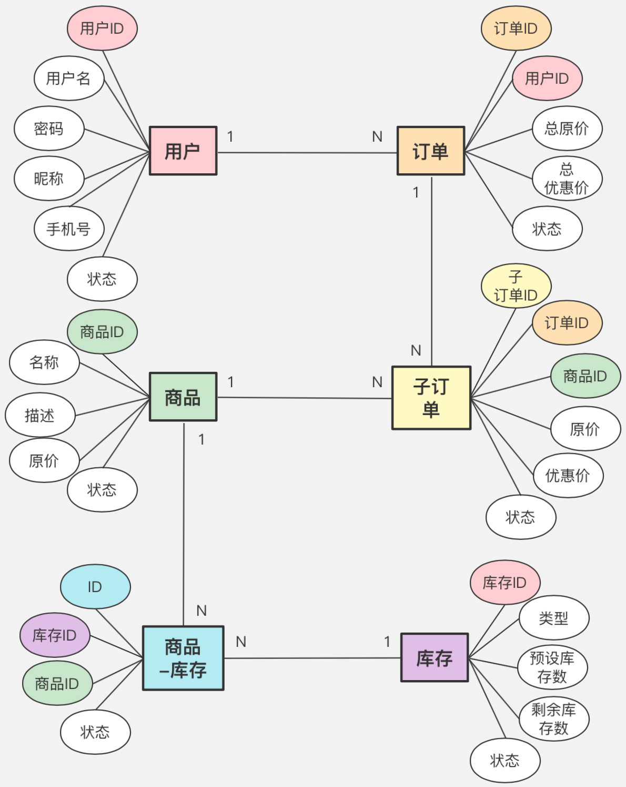

# 第五周作业

## 必做作业1
基于电商交易场景（用户、商品、订单），设计一套简单的表结构，提交 DDL 的 SQL 文件到 Github（后面 2 周的作业依然要是用到这个表结构）
### E-R 图

### 实体及实体关系分析
如上图所述，有实体用户、订单、子订单、商品、商品-库存、库存，以及它们的属性

它们之间的关系是：
- 一个用户可以有多个订单，每个订单只会对应一个用户
- 一个订单可能包含多个子订单，而子订单只会对应一个父订单
- 一个商品可能关联多个子订单，而一个子订单只会对应一个商品
- 一个商品可能关联多个渠道的库存，比如现在直播带货，同一个商品，不同的带货平台可能预设的库存不同；同样，一个库存，可能关联多个商品，比如双十一同类的几个产品，限制总共就卖多少件

### DDL(以MySQL为例)
```mysql
# 用户表
CREATE TABLE `users` (
  `id` int(11) unsigned NOT NULL AUTO_INCREMENT COMMENT '用户ID',
  `username` varchar(64) NOT NULL COMMENT '用户名',
  `password` varchar(128) NOT NULL COMMENT '密码(经过MD5加密)',
  `nickname` varchar(64) NOT NULL DEFAULT '' COMMENT '昵称',
  `phone` varchar(11) NOT NULL DEFAULT '' COMMENT '手机号',
  `status` tinyint(2) NOT NULL DEFAULT '1' COMMENT '状态 0无效 1有效',
  `create_time` timestamp NOT NULL DEFAULT CURRENT_TIMESTAMP COMMENT '创建时间',
  `update_time` timestamp NOT NULL DEFAULT CURRENT_TIMESTAMP ON UPDATE CURRENT_TIMESTAMP COMMENT '更新时间',
  PRIMARY KEY (`id`),
  UNIQUE KEY `uniq_username` (`username`)
) ENGINE=InnoDB DEFAULT CHARSET=utf8mb4 COLLATE=utf8mb4_0900_ai_ci COMMENT='用户表';

# 订单表
CREATE TABLE `orders` (
  `id` INT(11) UNSIGNED NOT NULL AUTO_INCREMENT COMMENT '自增ID',
  `user_id` INT(11) NOT NULL COMMENT '用户ID(users.id)',
  `order_id` BIGINT(16) NOT NULL COMMENT '订单ID',
  `original_amount` INT(11) NOT NULL DEFAULT '0' COMMENT '总原价',
  `amount` DOUBLE(16, 2) NOT NULL DEFAULT '0' COMMENT '总优惠(支付)价',
  `order_status` TINYINT(2) DEFAULT '0' COMMENT '订单支付状态：0待支付 1已支付 2已完全退款',
  `status` TINYINT(2) NOT NULL DEFAULT '1' COMMENT '订单数据状态 0无效 1有效',
  `create_time` TIMESTAMP NOT NULL DEFAULT CURRENT_TIMESTAMP COMMENT '创建时间',
  `update_time` TIMESTAMP NOT NULL DEFAULT CURRENT_TIMESTAMP ON UPDATE CURRENT_TIMESTAMP COMMENT '更新时间',
  PRIMARY KEY (`id`),
  KEY `idx_user_id` (`user_id`),
  KEY `idx_order_id` (`order_id`)
) ENGINE=INNODB DEFAULT CHARSET=utf8mb4 COMMENT='订单表';
# 注意，返回给前端的订单ID，必须转换成字符串，否则前端使用 JS 处理长整型会出现精度问题

# 子订单表
CREATE TABLE `sub_orders` (
  `id` INT(11) UNSIGNED NOT NULL AUTO_INCREMENT COMMENT '自增ID',
  `order_id` BIGINT(16) NOT NULL COMMENT '关联的父订单ID(orders.order_id)',
  `sub_order_id` BIGINT(16) NOT NULL COMMENT '子订单ID',
  `original_amount` DOUBLE(16, 2) NOT NULL DEFAULT '0' COMMENT '子订单原价',
  `amount` DOUBLE(16, 2) NOT NULL DEFAULT '0' COMMENT '子订单优惠(支付)价',
  `sku_id` INT(11) NOT NULL DEFAULT '0' COMMENT '关联的商品ID(products.id)',
  `order_status` TINYINT(2) DEFAULT '0' COMMENT '订单支付状态：0待支付 1已支付 2已退款',
  `status` TINYINT(2) NOT NULL DEFAULT '1' COMMENT '子订单数据状态 0无效 1有效',
  `create_time` TIMESTAMP NOT NULL DEFAULT CURRENT_TIMESTAMP COMMENT '创建时间',
  `update_time` TIMESTAMP NOT NULL DEFAULT CURRENT_TIMESTAMP ON UPDATE CURRENT_TIMESTAMP COMMENT '更新时间',
  PRIMARY KEY (`id`),
  KEY `idx_order_id` (`order_id`),
  KEY `idx_sub_order_id` (`sub_order_id`),
  KEY `idx_sku_id` (`sku_id`)
) ENGINE=INNODB DEFAULT CHARSET=utf8mb4 COMMENT='子订单表';

# 商品表
CREATE TABLE `products` (
  `id` INT(11) UNSIGNED NOT NULL AUTO_INCREMENT COMMENT '商品ID',
  `title` VARCHAR(64) NOT NULL COMMENT '商品标题',
  `description` VARCHAR(255) NOT NULL DEFAULT '' COMMENT '商品描述',
  `original_price` DOUBLE(16, 2) NOT NULL DEFAULT '0.0' COMMENT '商品原价',
  `price` DOUBLE(16, 2) NOT NULL DEFAULT '0.0' COMMENT '商品现付价格',
  `status` TINYINT(2) NOT NULL DEFAULT '1' COMMENT '状态 0下架 1上架',
  `create_time` TIMESTAMP NOT NULL DEFAULT CURRENT_TIMESTAMP COMMENT '创建时间',
  `update_time` TIMESTAMP NOT NULL DEFAULT CURRENT_TIMESTAMP ON UPDATE CURRENT_TIMESTAMP COMMENT '更新时间',
  PRIMARY KEY (`id`)
) ENGINE=INNODB DEFAULT CHARSET=utf8mb4 COMMENT='商品表';

# 库存表
CREATE TABLE `stocks` (
  `id` INT(11) UNSIGNED NOT NULL AUTO_INCREMENT COMMENT '库存ID',
  `title` VARCHAR(64) NOT NULL COMMENT '库存标题',
  `description` VARCHAR(255) NOT NULL DEFAULT '' COMMENT '库存描述',
  `type` TINYINT(2) NOT NULL DEFAULT '0' COMMENT '库存类型：1商品库存 2渠道库存',
  `stock_nums` INT(11) NOT NULL DEFAULT '0' COMMENT '预设总库存数',
  `remain_nums` INT(11) NOT NULL DEFAULT '0' COMMENT '剩余库存数',
  `status` TINYINT(2) NOT NULL DEFAULT '1' COMMENT '状态 0停用 1启用',
  `create_time` TIMESTAMP NOT NULL DEFAULT CURRENT_TIMESTAMP COMMENT '创建时间',
  `update_time` TIMESTAMP NOT NULL DEFAULT CURRENT_TIMESTAMP ON UPDATE CURRENT_TIMESTAMP COMMENT '更新时间',
  PRIMARY KEY (`id`)
) ENGINE=INNODB DEFAULT CHARSET=utf8mb4 COMMENT='库存表';

# 商品-库存关联表
CREATE TABLE `product_stocks` (
  `id` INT(11) UNSIGNED NOT NULL AUTO_INCREMENT COMMENT '自增ID',
  `sku_id` INT(11) NOT NULL DEFAULT '0' COMMENT '关联的商品ID(products.id)',
  `stock_id` INT(11) NOT NULL DEFAULT '0' COMMENT '关联的库存ID(stocks.id)',
  `status` TINYINT(2) NOT NULL DEFAULT '1' COMMENT '状态 0无效 1有效',
  `create_time` TIMESTAMP NOT NULL DEFAULT CURRENT_TIMESTAMP COMMENT '创建时间',
  `update_time` TIMESTAMP NOT NULL DEFAULT CURRENT_TIMESTAMP ON UPDATE CURRENT_TIMESTAMP COMMENT '更新时间',
  PRIMARY KEY (`id`),
  KEY `idx_sku_id` (`sku_id`),
  KEY `idx_stock_id` (`stock_id`)
) ENGINE=INNODB DEFAULT CHARSET=utf8mb4 COMMENT='商品-库存关联表';
```
