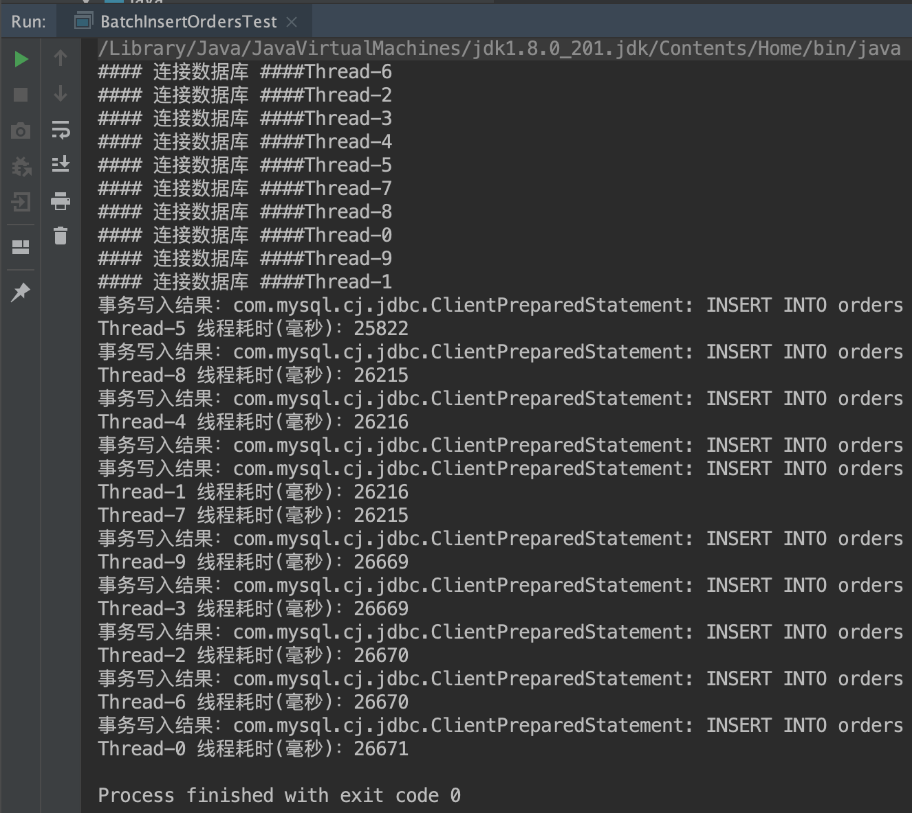

# 第七周作业

## 必做作业1
按自己设计的表结构，插入 100 万订单模拟数据，测试不同方式的插入效率tch
- 方法一：直接通过 MacOS 下的 MySQL 客户端 Sequel Pro，手动插入数据
    - 评价：手动导入数据非常不现实，效率非常低，最重要的是在 MySQl 客户端中因为SQL过大，客户端无响应，无法做任何操作
- 方法二：构造插入 100 万订单数据的 *.sql 文件，再通过 MySQL 客户端导入.sql文件的形式插入数据
    - 评价：这种方式非常适合 **旧表数据迁新表** 的场景，执行效率中等偏上；缺点是手动构造数据麻烦
- 方法三：直接编写 Java 文件，通过 JDBC 连接数据库，开启多个线程执行批量插入订单数据
    - [实践代码](https://github.com/junyangwei/java-problem-sets/commit/48fa8c4bc4f420d0d71d13862f3dc69b1930a8d5)
    - 评价：执行效率最高，通过程序中代码逻辑自动生成订单ID，不再需要人工构造数据；插入 100万订单模拟数据只需要 **30秒** 之内
    - 

数据库订单表结构参考
```mysql
CREATE TABLE `orders` (
  `id` int(11) unsigned NOT NULL AUTO_INCREMENT COMMENT '自增ID',
  `user_id` int(11) NOT NULL COMMENT '用户ID(users.id)',
  `order_id` bigint(16) NOT NULL COMMENT '订单ID',
  `original_amount` double(16,2) NOT NULL DEFAULT '0.00' COMMENT '总原价',
  `amount` double(16,2) NOT NULL DEFAULT '0.00' COMMENT '总优惠(支付)价',
  `order_status` tinyint(2) DEFAULT '0' COMMENT '订单支付状态：0待支付 1已支付 2已完全退款',
  `status` tinyint(2) NOT NULL DEFAULT '1' COMMENT '订单数据状态 0无效 1有效',
  `create_time` timestamp NOT NULL DEFAULT CURRENT_TIMESTAMP COMMENT '创建时间',
  `update_time` timestamp NOT NULL DEFAULT CURRENT_TIMESTAMP ON UPDATE CURRENT_TIMESTAMP COMMENT '更新时间',
  PRIMARY KEY (`id`),
  UNIQUE KEY `uniq_order_id` (`order_id`),
  KEY `idx_user_id` (`user_id`)
) ENGINE=InnoDB DEFAULT CHARSET=utf8mb4 COLLATE=utf8mb4_0900_ai_ci COMMENT='订单表';
```

## 选做作业2
按自己设计的表结构，插入 1000 万订单模拟数据，测试不同方式的插入效率
- 可直接参考必做作业1中的方法三，执行时间大概在 **300秒** 之内完成

## 选做作业3
使用不同的索引或组合，测试不同方式查询效率
```mysql
# 直接使用主键ID，执行效率最高，平均耗时约为 0.5ms
SELECT * FROM orders WHERE id = 2000000;

# 使用唯一索引 order_id，执行效率第二，平均耗时约为 0.6ms，根据InnoDB底层查询逻辑，先查到 orde_id 值对应的 主键ID，再通过 主键ID 查相关的数据，因此慢一点
SELECT * FROM orders WHERE order_id = 36780536199144537;

# 使用普通的索引 user_id，执行效率第三，平均耗时大于 0.6ms，主要影响点在于查出来的数据的多少，查的数据越多，耗时越久
SELECT * FROM orders WHERE user_id = 1234;

# 不使用任何索引 update_time，执行效率最低，平均耗时大于 800ms，查出来的数据了越多，耗时越久
SELECT * FROM orders WHERE update_time = '2021-11-13 13:46:29';
```

## 选做作业4
尝试自己做一个 ID 生成器（可以模拟 Seq 或 Snowflake）
- 在必做作业1方法三中已实现 [链接](https://github.com/junyangwei/java-problem-sets/commit/48fa8c4bc4f420d0d71d13862f3dc69b1930a8d5#diff-fb8c61aa2d3a6d0a2f8b442734fe244e95f749d6317388d6c7df38735ebbe46bR9)

## 必做作业2
读写分离 - 动态切换数据源版本 1.0
- [作业提交](https://github.com/junyangwei/druid-practice/commit/44638b719854c0af588d358c843dbfeb9dc3beed) 
- 有点把简单的问题复杂化了！

## 必做作业3
读写分离 - 数据库框架版本 2.0
- [作业提交](https://github.com/junyangwei/druid-practice/commit/cae546f9884a4525834f6cb62c7d4f143dc8e3ca)
不得不说，比起手动动态切换数据源版本，使用 ShardingSphere-JDBC 真的轻松太多了！！！
