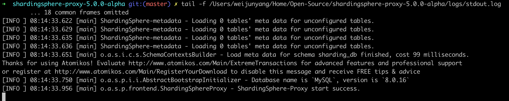
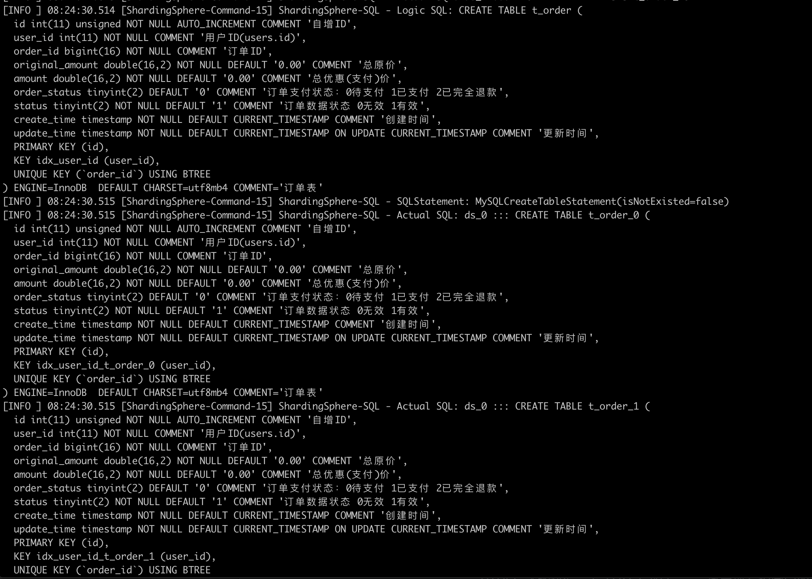
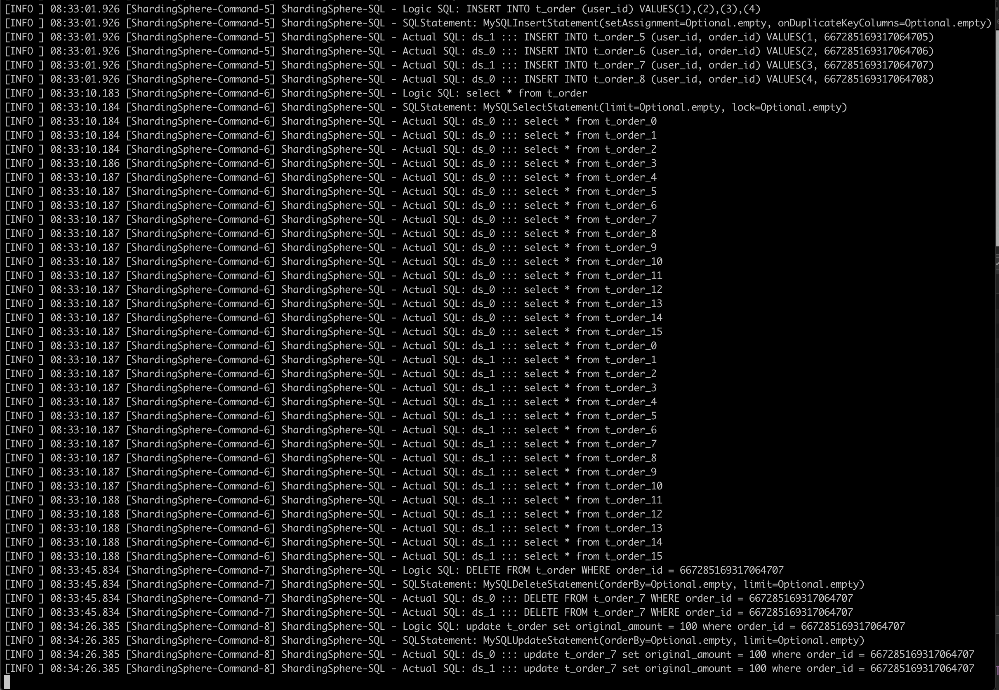
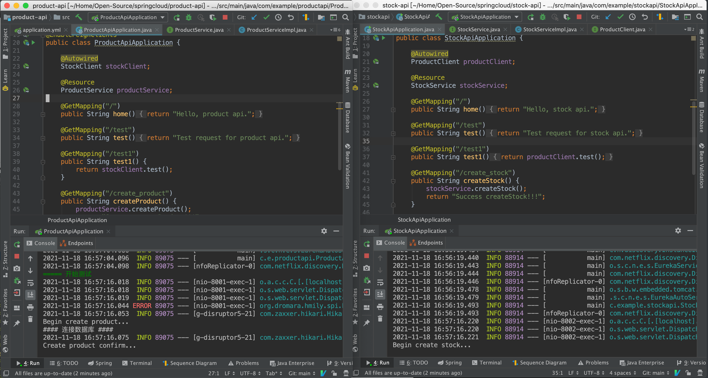
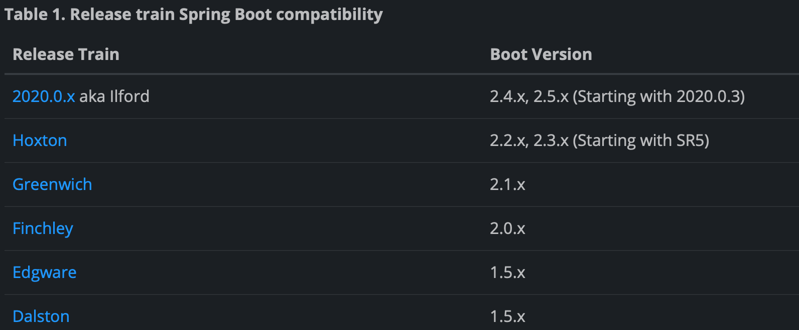

# 第八周作业

## 必做作业1
设计对前面的订单表数据进行水平分库分表，拆分 2 个库，每个库 16 张表。并在新结构在演示常见的增删改查操作。代码、sql 和配置文件，上传到 Github

打算通过使用 ShardingSphere-Proxy 来进行分库分表的测试

步骤：

进入本地 MySQL 数据库：`mysql -u root -p123456`

准备好创建库和表的语句

```mysql
# 创建数据库
CREATE SCHEMA demo_ds_0;
CREATE SCHEMA demo_ds_1;

# 创建数据库表——订单表
DROP TABLE IF EXISTS t_order;
CREATE TABLE t_order (
  id int(11) unsigned NOT NULL AUTO_INCREMENT COMMENT '自增ID',
  user_id int(11) NOT NULL COMMENT '用户ID(users.id)',
  order_id bigint(16) NOT NULL COMMENT '订单ID',
  original_amount double(16,2) NOT NULL DEFAULT '0.00' COMMENT '总原价',
  amount double(16,2) NOT NULL DEFAULT '0.00' COMMENT '总优惠(支付)价',
  order_status tinyint(2) DEFAULT '0' COMMENT '订单支付状态：0待支付 1已支付 2已完全退款',
  status tinyint(2) NOT NULL DEFAULT '1' COMMENT '订单数据状态 0无效 1有效',
  create_time timestamp NOT NULL DEFAULT CURRENT_TIMESTAMP COMMENT '创建时间',
  update_time timestamp NOT NULL DEFAULT CURRENT_TIMESTAMP ON UPDATE CURRENT_TIMESTAMP COMMENT '更新时间',
  PRIMARY KEY (id),
  KEY idx_user_id (user_id),
  UNIQUE KEY (`order_id`) USING BTREE
) ENGINE=InnoDB  DEFAULT CHARSET=utf8mb4 COMMENT='订单表';
```

去 [ShardingSphere官网](https://archive.apache.org/dist/shardingsphere/5.0.0-alpha/) 下载 apache-shardingsphere-proxy-5.0.0-alpha 版本

这里我遇到一个Bug：ShardingSphereException: Cannot load JDBC driver class `com.mysql.jdbc.Driver`, make sure it in ShardingSphere-Proxy's classpath

弄了很久才知道，原来要使用 mysql ，需要将对应版本的 mysql-connector-java-xxx.jar 包下载下来，放到文档目录的 /lib 下，花了好长时间，[详细参考](https://github.com/apache/shardingsphere/issues/6764)

于是我进入 [MySQL官网下载](https://downloads.mysql.com/archives/c-j/) 地址选择了Product Version:8.0.16 以及 Operating System: Platform Independent 下载了.tar.gz 包，解压后就得到了  mysql-connector-java-8.0.16.jar，再将它放到了 shardingsphere-proxy 下的 lib 目录内

重新执行启动命令：`bin/start.sh`

查看日志后终于显示启动成功：[INFO ] 18:23:54.529 [main] o.a.s.p.frontend.ShardingSphereProxy - ShardingSphere-Proxy start success.



连接 ShardingSphere-Proxy 的代理 MySQL：`mysql -h 127.0.0.1 -P 3307 -uroot -p123456 -A`

我在 shardingsphere-proxy 代理 MySQL 中，执行建表语句的时候，发现带有 UNIQUE KEY `uniq_order_id` (`order_id`) 的索引没办法执行，去掉之后或者指定为 USING BTREE 才能执行，在 GitHub 的 Issues 也发现有[相同问题](https://github.com/apache/shardingsphere/issues/8223)，貌似是 shardingsphere-proxy 的一个 Bug

执行建表语句，再看日志，发现 shardingsphere-proxy 已经将建表语句分别在 demo_ds_0 和 demo_ds_1 执行了15条建表语句，从 t_order_0 到 t_order_15



数据库创建的表相关图片参考：demo_ds_0_pic.png 和 demo_ds_1_pic.png

执行增/删/查/改的SQL 以及 shardingsphere-proxy 执行日志

```mysql
# 添加订单数据
INSERT INTO t_order (user_id) VALUES(1),(2),(3),(4);
# 查询所有订单数据
select * from t_order;
# 删除某条订单数据
DELETE FROM t_order WHERE order_id = 667285169317064707;
# 修改某条订单数据
update t_order set original_amount = 100 where order_id = 667285169317064707;
```



## 必做作业2
基于 hmily TCC 或 ShardingSphere 的 Atomikos XA 实现一个简单的分布式事务应用 demo（二选一），提交到 Github

基于 hmily TCC 或 ShardingSphere 的 Atomikos XA 实现一个简单的分布式事务应用 demo（二选一），提交到 Github

[作业地址](https://github.com/junyangwei/springcloud-test) 

本次作业我选择：Hmily TCC 来实现一个简单的场景： 调用 **商品服务A** 创建商品的接口，这个接口中内嵌了调用 **库存服务B** 的创建库存的demo接口，然后 A 服务中执行 confirm 的逻辑

Tips：作业初始化的 commit 带上了很多不相关的代码，可以跳过第一个 commit；执行结果参考下图



因为使用 hmily TCC 模式下，必须要使用一款 `RPC` 框架，因此我就选择了 SpringCloud，然而我之前并没有多少 SpringCloud 相关的实践经验，在这里踩了很多坑.... 

### 踩坑记录

一、 SpringCloud 项目一致无法启动，是因为 SpringBoot 和 SpringCloud 版本不一致导致的，参考 [官方文档](https://spring.io/projects/spring-cloud) 关于这方面的描述



二、Hmily 官方文档关于 SpringCloud 的包引入问题描述有误，单独引入 [hmily-spring-boot-starter-springcloud](https://mvnrepository.com/artifact/org.dromara/hmily-spring-boot-starter-springcloud) 包总会提示错误，`java.lang.ClassNotFoundException: com.netflix.hystrix.strategy.concurrency.HystrixConcurrencyStrategy`，还需要引入 [hystrix-core](https://mvnrepository.com/artifact/com.netflix.hystrix/hystrix-core) 才可以

三、SpringCloud 的概念以及基本知识导致耗费大量时间；

- 首先从思维层面来看，使用 SpringBoot 是以某个具体的服务为主，而引入 SpringCloud 是为了能够使多个子服务之间的调度更便捷；
- 我之前一直停留在单个服务，已为在单个服务中就能够完成 Hmily 的 demo，殊不知在思想上已经和其原设计目的就偏离了
- 解决：阅读 SpringCloud 官方文档后，目标变为设计三个服务
  - Eureka服务：负责服务注册与发现 （引入 spring-cloud-starter-netflix-eureka-server 依赖包）
    - 参考 Spring 官网的 [Service Discovery - Eureka Server](https://docs.spring.io/spring-cloud-netflix/docs/current/reference/html/#spring-cloud-eureka-server)
  - 商品服务：负责商品业务模块，服务注册到 Eureka 的客户端，以及作为服务间调用 OpenFeign 的客户端（引入 spring-cloud-starter-netflix-eureka-client 和 spring-cloud-starter-openfeign 依赖包）
    -  [Service Discover - Eureka Client](https://docs.spring.io/spring-cloud-netflix/docs/current/reference/html/#service-discovery-eureka-clients)
    - 参考官网 [Declarative REST Client - Feign](https://docs.spring.io/spring-cloud-openfeign/docs/current/reference/html/)
  - 库存服务：负责库存业务模块，其它与商品服务相同
- 实现三个服务后，再引入 Hmily 来负责分布式事务的调度，才会水到渠成，变得非常简单了

四、将商品服务接入 Hmily，并且实现了 try、confirm、cancel 方法，在调用接口时总回报下面的错误；绕了一圈查询 hmily 在 GitHub 上的 [相关源码](https://github.com/dromara/hmily/blob/master/hmily-repository/hmily-repository-database/hmily-repository-database-mysql/src/main/resources/mysql/schema.sql) 才发现，它需要创建这两张表在数据库中，在因为网络抖动或其他调用失败的场景，会写入事务失败记录到数据库，但 Hmily 官方文档并没有相关的说明！！！

```tex
2021-11-18 15:13:52.067 ERROR 85273 --- [saction-clean-3] o.d.h.r.d.manager.AbstractHmilyDatabase  : hmily jdbc executeQuery repository exception -> 
java.sql.SQLSyntaxErrorException: Table 'sell.hmily_transaction_global' doesn't exist
	at com.mysql.cj.jdbc.exceptions.SQLError.createSQLException(SQLError.java:120) ~[mysql-connector-java-8.0.26.jar:8.0.26]
...
java.sql.SQLSyntaxErrorException: Table 'sell.hmily_transaction_participant' doesn't exist
	at com.mysql.cj.jdbc.exceptions.SQLError.createSQLException(SQLError.java:120) ~[mysql-connector-java-8.0.26.jar:8.0.26]
...
```

