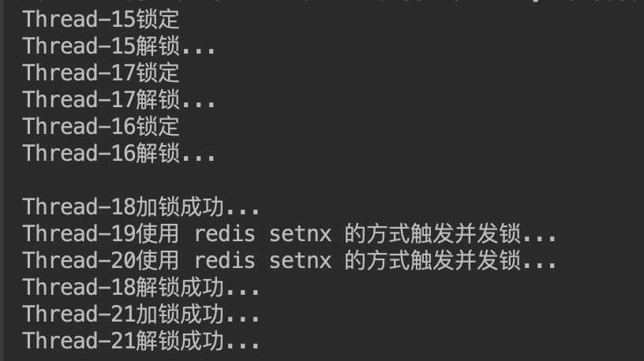
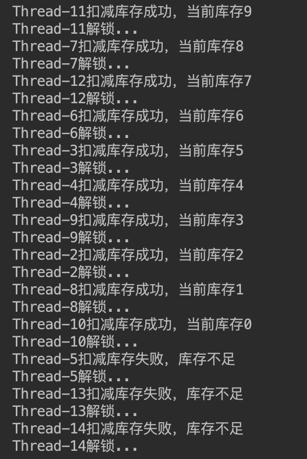
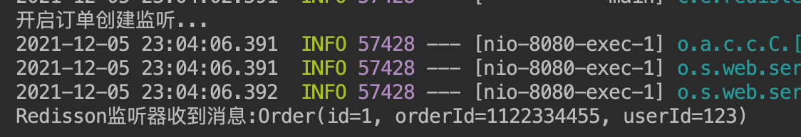

# 第十一周作业

## 必做作业1
基于 Redis 封装分布式数据操作
- 在 Java 中实现一个简单的分布式锁；
    - [相关测试代码链接](https://github.com/junyangwei/java-problem-sets/blob/main/11redis/redistest/src/main/java/com/example/redistest/RedistestApplication.java#L27)
    - [Redisson 客户端配置](https://github.com/junyangwei/java-problem-sets/blob/main/11redis/redistest/src/main/java/com/example/redistest/RedissonConfiguration.java)
    - 备注：尝试了两种方式，第一种是使用 redisson 的 tryLock，第二种是使用 redisson 的 trySet，相当于使用 redis 的 setnx 来实现
    - 测试：项目启动后测试链接为 http://localhost:8080/test_lock
- 在 Java 中实现一个分布式计数器，模拟减库存；
    - [相关测试代码链接](https://github.com/junyangwei/java-problem-sets/commit/d48b9ec5e2c1d0914ba11dd466cdd197738cbe64)
    - 备注：使用了分布式锁 + set 方法模拟扣减库存，并进行库存为0校验
    - 测试：项目启动后测试链接为 http://localhost:8080/test_sub_stock

### 测试结果及分析

#### 分布式锁相关
- 两个方法都是使用 Redisson 封装的 redis 方法
- 第一种使用 tryLock 方法：从打印结果上看，就像是之前多线程抢占锁一样，先抢先操作，后面的线程阻塞排队，等待前面抢占的锁释放，非常有序；
- 第二种使用 trySet 方法：从打印结果上看，就是并发抢占锁，先抢的先操作，其它触发分布式锁，提示失败；
- 分析：这个和代码逻辑设计也直接相关，关键在于是否需要阻塞，如果不需要就可以像第二种一样，直接提示繁忙之类的，直接返回

- 这里我使用了 Redisson 封装的 tryLock 方法和 set 方法
- 在扣减库存前先加锁，然后再取库存，减库存
- 可优化项：扣减 redis 中的缓存库存数据后，可以再扣减数据库的库存，通过乐观锁的方式，校验数据库是否扣减成功
    - 这个问题又涉及到：先改缓存，还是先改数据库；一般的做法应该是先改缓存，再改数据库；
    - 先改缓存，缓存失败，全部操作失败
    - 先改缓存成功，改数据库失败，则缓存的库存数据与数据库的小，只会导致少卖几件物品
    - 如果顺序反过来，先改数据库成功，改缓存失败，就会导致没有库存了，页面仍然展示有库存，增加数据库压力

## 必做作业2
基于 Redis 的 PubSub 实现订单异步处理
- [相关测试代码commit](https://github.com/junyangwei/java-problem-sets/commit/46b2371a7ae32207b8c7834258df9b4134ae880f)
- 测试：项目启动后测试链接为 http://localhost:8080/order_publish

### 测试结果及分析

- 这里只是简单的写了一个 demo，在项目启动时开启对订单创建的监听
- 在触发订单创建时，监听侧打印基本的订单消息
- 一般使用场景可能是收到相关消息后，就会做一些诸如日志打印、通知等功能
- **汇总：**
    - 订阅和发布的功能确实很好用，这样可以实现高内聚低耦合
    - 订单只需要处理自己本身的业务
    - 其他的业务侧监听消息，再触发相关操作，不需要将代码耦合在一起
    - 不过我们公司使用的是 Kafka 或者 RabbitMQ 来做这方面的事，后面的学习应该会说明两者的区别吧，这里先埋个疑问点！
